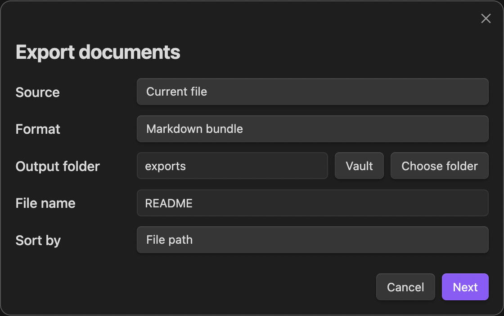

# Document Exporter

Export notes, folders, and filtered results into Markdown bundles, HTML documents, and print-ready exports.

## Features

- **Markdown bundle** — combines selected notes into a single `.md` file with copied attachments and rewritten links
- **HTML document** — generates a standalone `.html` with table of contents and linked assets
- **Print-ready HTML** — produces HTML optimized for browser print / Save as PDF

## Usage

Multiple ways to start an export:

| Entry point | How |
|-------------|-----|
| Sidebar icon | Click the export icon in the left sidebar |
| Right-click a file | File explorer → right-click a Markdown file → "Export this file" |
| Right-click a folder | File explorer → right-click a folder → "Export this folder" |
| Right-click in editor | Right-click inside a note → "Export current file" |
| Command palette | `Cmd/Ctrl+P` → "Export documents" |

### Export dialog



1. Choose **source** — current file, folder, selected files, or tag filter
2. Choose **format** — Markdown bundle, HTML document, or Print-ready HTML
3. Set **output folder** — type a path, click **Vault** to pick from vault folders, or **Choose folder** to select a system folder (desktop only)
4. Set **file name** — defaults to the source file or folder name
5. Click **Next** → review the summary → click **Export**

A notification shows the output path when export completes.

## Examples

### Export the current note as Markdown

1. Open a note → right-click → **Export current file**
2. Format: **Markdown bundle**, output: `exports`
3. Click **Export**
4. Result: `exports/<filename>.md` + `exports/assets/` (if images exist)

### Export a folder as HTML

1. Right-click a folder → **Export this folder**
2. Format: **HTML document**
3. Click **Export**
4. Result: a standalone `.html` with all notes combined and a table of contents

### Export notes as PDF

1. Start an export from sidebar icon or command palette
2. Format: **Print-ready HTML** → click **Export**
3. Open the exported `.html` in your browser → `Cmd/Ctrl+P` → Save as PDF

## Settings

Open **Settings → Document Exporter**.

| Setting | Description | Default |
|---------|-------------|---------|
| Output folder | Where exported files are saved | `exports` |
| Default export format | Format pre-selected when opening the dialog | Markdown bundle |
| Default sort mode | How notes are ordered in the output | File path |
| Include source path comments | Add HTML comments showing each section's origin | Off |
| Copy attachments | Copy referenced images and files into the export | On |
| Overwrite existing exports | Overwrite if output already exists; otherwise a timestamped folder is created | Off |

## Limitations

- Direct PDF generation is not supported — use Print-ready HTML and browser print instead
- Inline note embeds (`![[Note]]`) are preserved as links, not expanded
- Dataview queries are not executed during export
- Canvas files are not supported
- The built-in Markdown-to-HTML converter handles common syntax but not all Obsidian-specific rendering (callouts, mermaid, math)

## Privacy

Document Exporter does not make any network requests. All processing happens locally. No data is sent to external services.

## Installation

Search "Document Exporter" in **Settings → Community plugins → Browse** and click Install.

### Manual installation

Copy `main.js`, `manifest.json`, and `styles.css` into your vault's `.obsidian/plugins/document-exporter/` directory.

## Development

```bash
npm install
npm run dev      # watch mode
npm run build    # production build
npm test         # run tests
```

## License

MIT
