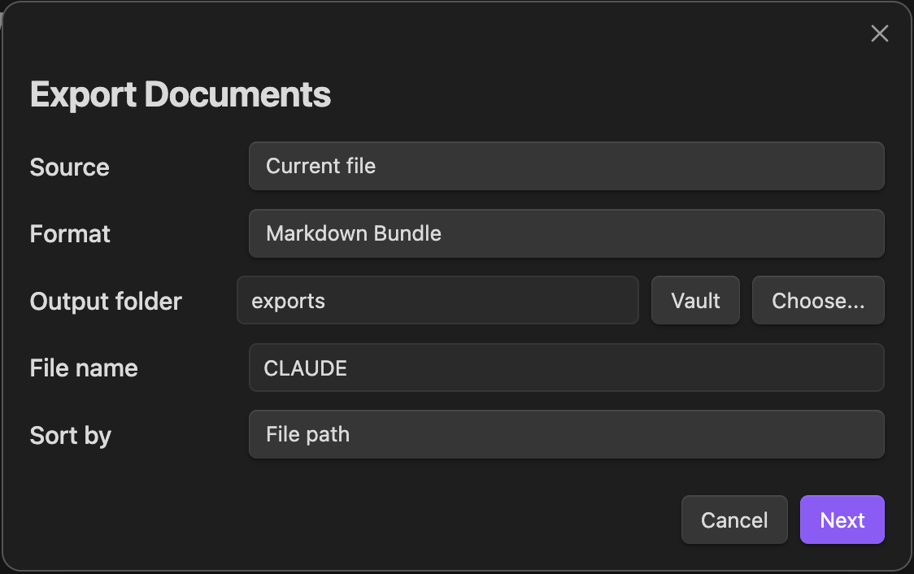

# Document Exporter

An Obsidian plugin for exporting notes, folders, and query results into Markdown bundles, HTML documents, and print-ready exports.

## Features

- **Markdown Bundle** — combines selected notes into a single `.md` file with copied attachments and rewritten links
- **HTML Document** — generates a standalone `.html` with table of contents and linked assets
- **Print-ready HTML** — produces HTML with print stylesheet and hint banner for PDF output via browser print dialog

## How to Use

There are multiple ways to start an export:

| Entry Point | How |
|-------------|-----|
| **Sidebar icon** | Click the export icon in the left sidebar |
| **Right-click a file** | In the file explorer, right-click a Markdown file → "Export this file" |
| **Right-click a folder** | In the file explorer, right-click a folder → "Export this folder" |
| **Right-click in editor** | Right-click inside a note → "Export current file" |
| **Command palette** | `Cmd/Ctrl+P` → type "Export documents" |

### Export Dialog



1. Choose **source** (current file / folder / selected files / tag filter)
2. Choose **format** (Markdown Bundle / HTML / Print-ready HTML)
3. Choose **output folder** — type a path, click **Vault** to pick from vault folders, or **Choose...** to pick a system folder (desktop only)
4. Set **file name** — defaults to the source file or folder name
5. Click **Next** → review the summary → click **Export**
6. A notification shows the output path when done

## Examples

### Export the current note as Markdown

1. Open a note in the editor
2. Right-click → **Export current file**
3. Format: **Markdown Bundle**, Output: `exports`
4. Click **Export**
5. Result: `exports/<filename>.md` + `exports/assets/` (if there are images)

### Export a folder as HTML

1. In the file explorer, right-click a folder (e.g. `projects/my-project`)
2. Click **Export this folder**
3. Format: **HTML Document**, Output: pick any folder
4. Click **Export**
5. Result: `<folder>/<filename>.html` — open in a browser, all notes are combined with a table of contents

### Export notes as a PDF

1. Start an export (sidebar icon or command palette)
2. Source: select files or folder
3. Format: **Print-ready HTML**
4. Click **Export**
5. Open the exported `.html` in your browser
6. Press `Cmd/Ctrl+P` → Save as PDF

## Settings

Open **Settings → Document Exporter**.

| Setting | Description | Default |
|---------|-------------|---------|
| **Output folder** | Where exported files are saved (relative to vault root). Change this to any folder you like. | `exports` |
| Default export format | Format used when opening the export dialog | Markdown Bundle |
| Default sort mode | How notes are ordered in the output | File path |
| Include source path comments | Add HTML comments showing each section's origin | Off |
| Copy attachments | Copy referenced images and files into the export bundle | On |
| Overwrite existing exports | Overwrite if the output folder already exists. Otherwise a timestamped folder is created. | Off |

## Limitations

- Direct PDF generation is not supported — use Print-ready HTML and browser print instead
- Inline note embeds (`![[Note]]`) are not expanded; they are preserved as links
- Dataview queries are not executed during export
- Canvas files are not supported
- The built-in Markdown-to-HTML converter handles common syntax but does not support all Obsidian-specific rendering (callouts, mermaid, math)

## Privacy

Document Exporter does not make any network requests. All processing happens locally within Obsidian. No data is sent to external services.

## Installation

Copy `main.js`, `manifest.json`, and `styles.css` into your vault's `.obsidian/plugins/document-exporter/` directory.

## Development

```bash
npm install
npm run dev      # watch mode
npm run build    # production build
npm test         # run tests
```

## License

MIT
